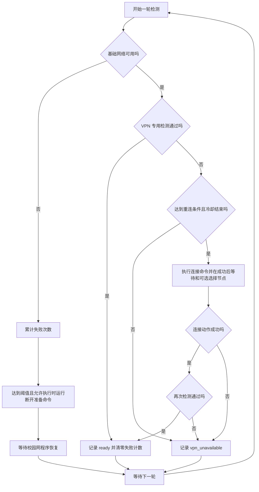

# 自动重连怎么工作

自动重连的顺序是：**先恢复基础网络，再让 VPN 客户端执行连接操作，最后实际测试连接是否可用。** 发现本机代理地址，只能帮助检测连接；要自动重连，还需要客户端提供可以执行的连接命令或控制接口。

本文说明当前代码已经具备的逻辑，以及新手版继续接入自动重连时需要实现的部分。

## 当前版本可以做什么

| 入口 | 当前行为 | 开启自动重连需要什么 |
|---|---|---|
| 校园网程序 `AutoSZUWeb.exe` | 基础网络异常后尝试校园网认证 | 首次配置校园网账号，并保持程序运行 |
| 新手连接助手 `AutoSZUWeb-Connect.exe` | 自动识别可用本机代理，持续检测并显示结果 | 当前没有客户端连接适配，窗口里的“开始监测”不会开启 VPN 自动重连 |
| 高级脚本 `scripts/vpn_sync.py` | 在满足触发条件时执行连接命令，可选调用 Clash API 选择指定节点 | 配置真实的连接动作或适用的 Clash API，以及准确的联网检测方法 |

新手助手目前生成的配置里，连接命令为空，Clash API 也未启用。因此，**你现在电脑上的肥猫云可以被监测，但尚未由这个新版本自动点击重连。** 这和原来 NetGuardian 的客户端适配能力是两回事。

## 用一个掉线例子理解

电脑连着校园网，VPN 原本也能使用。过了一会儿，网页打不开：

1. 先检测不经过 HTTP 代理的基础网络。若检测失败，等待校园网程序恢复网络；如果 VPN 路由妨碍校园认证，执行事先配置的断开准备命令。
2. 基础网络恢复后，再经所选代理访问测试网址。若测试已经通过，就继续监测，不额外执行连接动作。
3. 若代理访问仍失败，执行事先配置的客户端连接动作。例如启动一个已保存配置的客户端，或调用其明确的连接命令。
4. 可选调用 Clash / Mihomo 的控制接口，选回事先指定的节点。
5. 再实际访问测试网址。只有测试通过才记录 `ready`；启动了程序、连接命令返回成功或 API 接受了选节点请求，都不能单独证明网络已经恢复。
6. 若仍失败，进入等待，达到冷却时间后再尝试。用户可以停止脚本，交给客户端手动处理。

这里的“基础网络检测通过”是联网探测结果，不等于读取了校园网认证状态。校园网程序和联动脚本各自检测网络，使用的方法也不同。

## 当前高级脚本的流程

对应实现是 [`Coordinator.tick()` 和 `Adapter.connect()`](../scripts/vpn_sync.py)。关键规则如下，数值均可在高级配置里调整：

| 项目 | 默认值 | 作用 |
|---|---|---|
| `interval_sec` | 10 秒 | 每轮检测完成后等待，再开始下一轮 |
| `offline_threshold` | 连续 2 次 | 基础网络连续失败后，才尝试断开准备动作 |
| `vpn_failure_threshold` | 连续 2 次 | 基础网络可用时，VPN 连续失败后触发连接尝试 |
| `cooldown_sec` | 60 秒 | 同类动作两次尝试之间至少间隔这么久；准备和连接分别计时 |
| `settle_sec` | 3 秒 | 连接动作成功后，留出客户端启动时间，再选节点并复测 |

校园网已经连续失败、随后恢复时，如果 VPN 检测失败且冷却允许，可以立即尝试连接，无需再等两次 VPN 失败。此前准备动作成功的状态也会触发这一分支。

检测、命令执行和等待客户端启动本身也需要时间，所以默认值不意味着“断网恰好 20 秒后重连”或“每 60 秒必定重连”。准备动作失败会在冷却允许后重试；准备成功后，在基础网络恢复前不重复执行。VPN 检测失败不会让脚本重新提交校园网账号密码。

`before_auth` 不是校园网认证函数中的同步回调。两个程序独立运行，准备操作执行时校园网程序可能已经在尝试认证；解除 VPN 干扰后，由它自己的后续尝试恢复。

## 不同 VPN，连接动作怎么接

| 客户端能力 | 可以接入的动作 | 必须明确的限制 |
|---|---|---|
| Clash / Mihomo 有本地控制接口 | 可启动已配置的客户端，再通过 API 选指定节点 | 当前选择固定节点；没有自动遍历备用节点，也没有调用 API 重启内核或清除连接 |
| 客户端提供连接命令 / 官方脚本 | `connect.argv` 调用连接命令；必要时 `before_auth.argv` 调用断开命令 | 命令须能重复执行并保持连接，不能是“点击一次连接、再点一次断开”的切换动作 |
| 客户端启动后会自动连接 | 将启动动作作为连接命令 | 仅启动 EXE 不保证已运行但失联的客户端会重新连接，需要先验证客户端行为 |
| 只有界面连接按钮，例如当前肥猫云接入场景 | 需要单独的客户端适配器 | 本 fork 目前没有内置这种适配；识别到代理地址也无法替代按钮操作 |
| OpenVPN、WireGuard、系统或单位 VPN | 调用该客户端的实际连接方式，并测试其专用网络 | 没有统一命令；只有公共网址访问成功不能证明这类隧道已连接 |

高级脚本的连接动作按顺序执行：`connect.argv` → 等待 `settle_sec` → 可选 Clash 选节点 → 复测。命令失败时不会继续选节点。两种动作都未配置时，脚本只会再次检测，不会凭空生成客户端连接能力。

Clash API 选节点使用 `PUT /proxies/{组名}`，提交指定节点名称，参见 [Mihomo 官方接口说明](https://wiki.metacubex.one/api/#proxiesproxies_name)。这项操作改变选择结果；重新选择同一个失效节点不保证能恢复网络。若客户端已有自动回退策略，需要由客户端自身的配置发挥作用，当前脚本不会自动建立或改写该策略。

脚本避免重复启动自己启动且仍存活的长驻进程，但不会自动结束其他客户端进程。程序退出和程序仍在运行但节点不可用，应由接入动作分别处理，不能统一用“不断启动 EXE”解决。

## 现在怎样配置自动重连

这一节供维护者或帮新手配置的人操作。当前新手助手没有这些设置项，而且每次开始监测都会生成仅监测配置；不要靠修改助手目录里的配置来启用高级动作。

1. 保持校园网程序运行，并确认 VPN 手动连接正常。停止其他会操作同一个 VPN 的联动程序，避免重复执行连接动作。
2. 从 [Clash 示例](../examples/vpn-sync.clash.example.json) 或 [通用示例](../examples/vpn-sync.generic.example.json) 复制独立的本地配置。
3. 配置检测方式：HTTP / mixed 代理应强制经过真实代理；全隧道应测试只有连接该 VPN 后才能访问的服务。HTTP 200 还需要配置预期正文，以排除认证页面。
4. 配置至少一个真实的恢复动作：客户端的连接命令，或适用的 Clash API 选节点。按需要设置断开准备动作。控制接口及其密钥应按客户端实际设置填写，代理地址和控制接口是不同用途。
5. 按 [高级使用指南](vpn-sync.md) 先检查配置、执行只读检测，再设置 `enabled: true` 并启动脚本。
6. 验证所配置的故障：例如由测试者关闭独立测试客户端，观察脚本是否确实恢复并再次通过网络检测。不能用“命令没报错”代替联网验证。

TUN 和 VPN 路由仍会影响基础网络检测，跳过 HTTP 代理不会绕开它们。校园认证地址应保持直连；配置方法及可选断开准备动作见[路由说明](vpn-sync.md#tun--全局路由特别注意)。

**当前肥猫云配置的连接命令为空，因此它现在不会自动重连。** 要接入这类客户端，先确定是否有官方连接接口；若只有界面按钮，再开发能判断当前连接状态、重复执行不误断开、连接后可复测的适配器。适配器完成后才能把它填入连接动作。

## 让小白也能开启自动重连：后续界面设计

以下是待实现的设计，尚未包含在当前预览版：

1. 用户选择或确认自己使用的 VPN 软件，助手匹配已验证的客户端适配器；代理地址由程序处理。
2. 显示该客户端的实际能力：“支持自动重连”或“目前仅监测”。不把所有检测到的代理都显示为可重连。
3. 有控制接口的客户端，在本机读取或引导设置接口；密钥保存在本机凭据库。需要用户登录、权限或首次连接时，用界面说明完成。
4. 让用户先试一次已验证的恢复动作，显示动作结果和联网复测结果，再提供“掉线后自动重连”开关。
5. 运行时显示“等待校园网”“正在尝试连接”“连接已恢复”“需要手动处理”。增加暂停操作和明确的失败处理，方便用户主动关闭 VPN。

这需要逐个接入客户端。没有可用适配器时，界面继续提供监测，并说明需要手动操作；不会让小白填写不存在的“通用重连端口”。

## 已验证和未验证

现有自动化测试覆盖故障计数、基础网络恢复、连接失败、冷却重试、命令超时、重复进程与实际代理请求；新手入口另有代理识别和界面状态测试。

2026-10-03 的 Windows 实机测试使用独立 Mihomo 实例，已验证“测试客户端退出 → 脚本检测失败 → 自动重新启动 → API 选节点 → 代理 HTTPS 测试通过”。测试实例通过原有肥猫云代理访问外网；这验证的是独立 Mihomo 实例的恢复，**没有断开并重连原有肥猫云**。

尚未实测校园网注销 / 掉线后的重新认证、肥猫云按钮自动操作、其他隧道客户端和 macOS 真机 VPN 恢复。校园网程序、新手助手和高级脚本的验证范围不能互相替代，详见[实机验证记录](vpn-sync.md#2026-10-03-windows-实机验证)。
